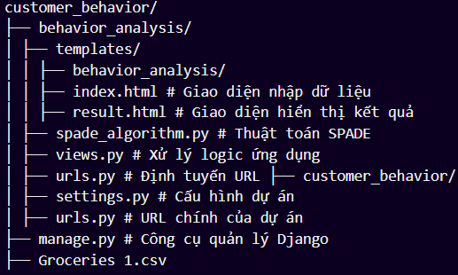

# Phân Tích Hành Vi Khách Hàng Bằng Thuật Toán SPADE

## **Giới thiệu**
Đồ án này triển khai một ứng dụng web sử dụng thuật toán **SPADE** (Sequential Pattern Discovery using Equivalence classes) để phân tích hành vi mua sắm của khách hàng. Mục tiêu là tìm ra các mẫu tuần tự phổ biến trong dữ liệu giao dịch.
---

## **Chức năng chính**
1. **Giao diện nhập dữ liệu**:
   - Cho phép người dùng tải lên file CSV chứa dữ liệu giao dịch.
   - Nhập giá trị `minsup` (ngưỡng hỗ trợ tối thiểu) để lọc các mẫu tuần tự phổ biến.

2. **Xử lý dữ liệu**:
   - Tiền xử lý dữ liệu giao dịch để chuyển đổi thành chuỗi tuần tự.
   - Áp dụng thuật toán SPADE để trích xuất các mẫu tuần tự phổ biến.

3. **Hiển thị kết quả**:
   - Hiển thị các mẫu tuần tự phổ biến và tần suất xuất hiện của chúng trên giao diện web.

---

## **Công nghệ sử dụng**
- **Ngôn ngữ lập trình**: Python
- **Framework web**: Django
- **Thư viện hỗ trợ**:
  - `pandas`: Xử lý dữ liệu CSV.
  - `collections`: Hỗ trợ các cấu trúc dữ liệu như `defaultdict`.

---
## **Thành viên nhóm**
- Nguyễn Thành Phát - MSSV: 2001223618
- Nguyễn Hoàng Gia Huy - MSSV: 2001221669
- Lường Minh Vinh - MSSV: 2001225866

---
## **Cấu trúc dự án**
Dưới đây là cấu trúc thư mục của dự án:



---

## **Hướng dẫn sử dụng**
1. **Cài đặt môi trường**:
   - Cài đặt Python (phiên bản >= 3.10).
   - Cài đặt các thư viện cần thiết:
     ```bash
     pip install django pandas
     ```

2. **Chạy ứng dụng**:
   - Di chuyển vào thư mục dự án:
     ```bash
     cd customer_behavior
     ```
   - Chạy server Django:
     ```bash
     python manage.py migrate
     python manage.py runserver
     ```
   - Truy cập ứng dụng tại: [http://127.0.0.1:8000](http://127.0.0.1:8000).

3. **Sử dụng ứng dụng**:
   - Tải lên file CSV chứa dữ liệu giao dịch.
   - Nhập giá trị `minsup` để phân tích.
   - Xem kết quả các mẫu tuần tự phổ biến và tần suất của chúng.